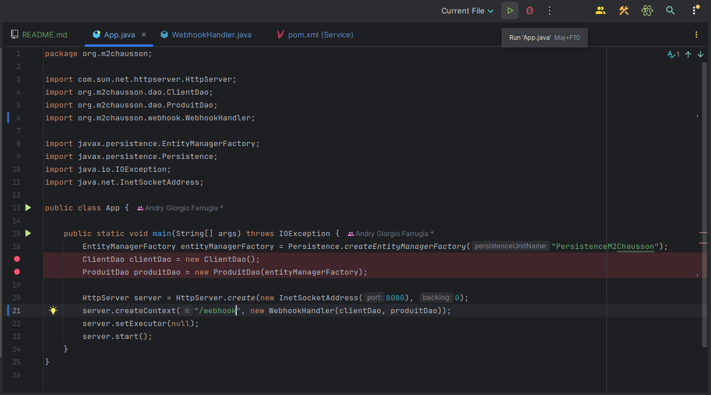
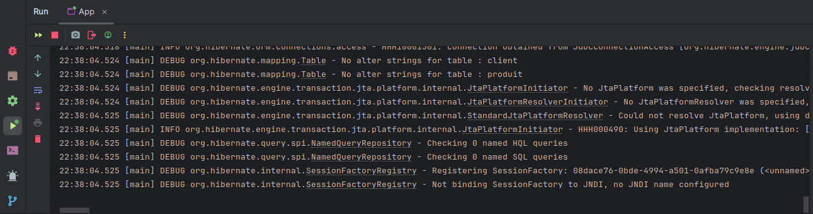

# Java with Maven

This project is a demonstration of a Java application with Maven that implements **DAOs (Data Access Objects)** for managing **CRUD (Create, Read, Update, Delete)** operations on a Dockerized PostgreSQL database. The application contains **Entities** fed by the DAOs and utilizes **Webhooks** for interactions between external systems.

## Technologies


## Table of Contents

1. [Step 1: Build the Project](#step-1-build-the-project)
2. [Step 2: Run App.java](#step-2-run-appjava)
3. [Step 3: Testing the Webhook](#step-3-testing-the-webhook)

## STEP 1 : Build the project
**At the root of the project**
```bash
mvn clean install
```

## STEP 2 : Run the App.java



**LOGS :**


## STEP 3 : Testing the webhook
**Open a new terminal and execute the command lines below :**

**Create a client :**
```bash
curl -X POST http://localhost:8080/webhook -H "Content-Type: application/json" -d '{"type":"client","name":"Andry Giorgio FARRUGIA"}'
```


**Create a product :**
```bash
curl -X POST http://localhost:8080/webhook -H "Content-Type: application/json" -d '{"type":"produit","name":"Béton","prix":62.5,"typeProduit":"BTP"}'
```